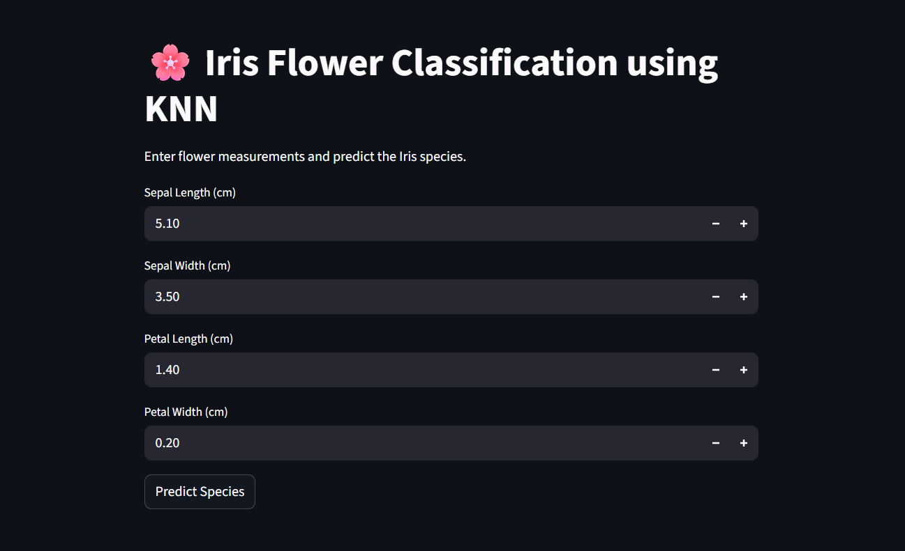
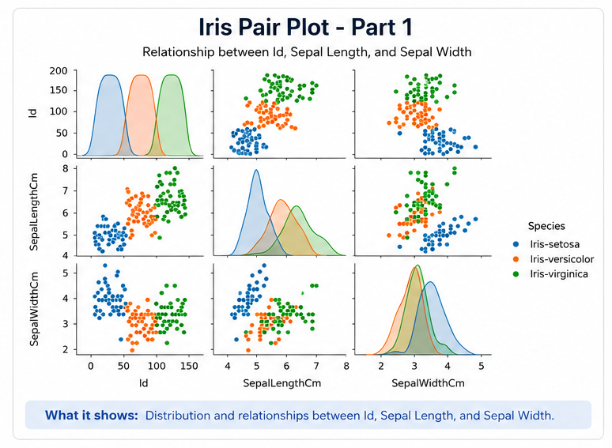
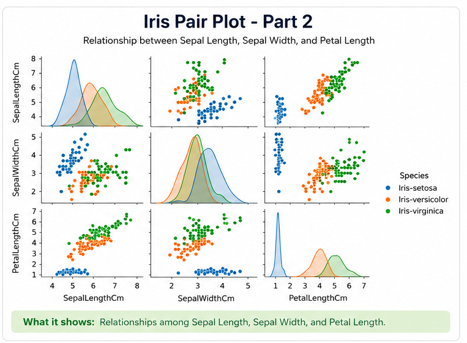
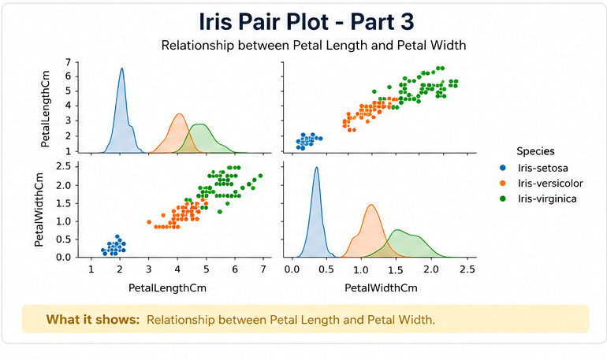
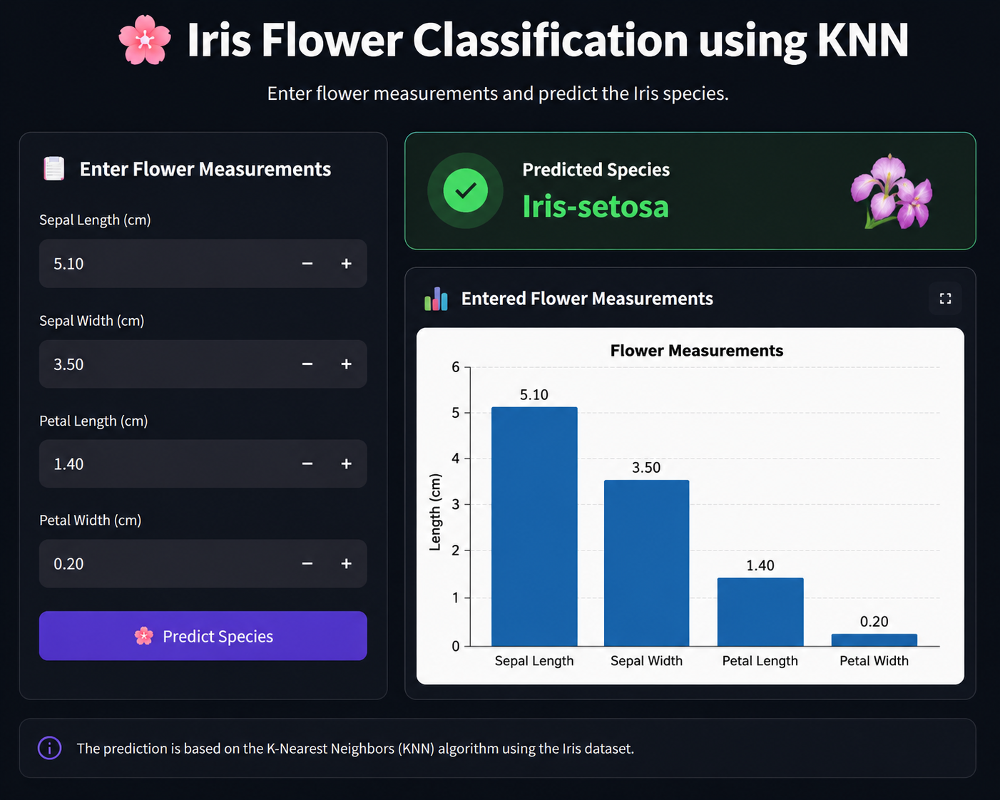

# 🌸 Iris Flower Classification using KNN

A Machine Learning based web application that predicts the species of an Iris flower using flower measurements.


---

# 📌 About The Project

The **Iris Flower Classification System** is a Machine Learning project that classifies Iris flowers into one of three species:

- 🌼 Iris Setosa
- 🌷 Iris Versicolor
- 🌺 Iris Virginica

The prediction is based on the following flower measurements:

- 📏 Sepal Length
- 📏 Sepal Width
- 📏 Petal Length
- 📏 Petal Width

The project uses a trained **K-Nearest Neighbors (KNN)** model and an interactive **Streamlit dashboard** for real-time predictions.

---

# 📑 Table of Contents

- ✨ Features
- 🛠️ Tech Stack
- 📂 Dataset
- 📸 Screenshots
- ⚙️ Installation
- 🚀 Usage
- 📁 Project Structure
- 📊 Model Performance
- 🎯 Learning Outcomes
- 👨‍💻 Author

---

# ✨ Features

- Iris flower species prediction

- Interactive Streamlit interface

- K-Nearest Neighbors (KNN) model

- Data visualization using Seaborn

- User input measurement graph

- Model saved using Joblib

- Real-time predictions

---

# 🛠️ Tech Stack

| Technology   | Purpose                 |
| ------------ | ----------------------- |
| Python       | Programming Language    |
| Pandas       | Data Processing         |
| NumPy        | Numerical Operations    |
| Matplotlib   | Data Visualization      |
| Seaborn      | Pair Plot Visualization |
| Scikit-Learn | Machine Learning        |
| Joblib       | Model Saving            |
| Streamlit    | Web Application         |

---

# 📂 Dataset

The Iris dataset contains **150 flower samples** divided into three classes.

### Features

| Feature       | Description  |
| ------------- | ------------ |
| SepalLengthCm | Sepal Length |
| SepalWidthCm  | Sepal Width  |
| PetalLengthCm | Petal Length |
| PetalWidthCm  | Petal Width  |

### Target

| Species         |
| --------------- |
| Iris-setosa     |
| Iris-versicolor |
| Iris-virginica  |

---

# 📸 Screenshots

## 🖥️ Dashboard



## 📈 Graph / Visualization Output





### 🌸 Prediction Result



---

# ⚙️ Installation

## 1️⃣ Clone Repository

```bash
git clone hhttps://github.com/29tarunchahar/Iris-Flower-Classification
```

## 2️⃣ Move to Project Folder

```
cd Iris-Flower-Classification
```

## 3️⃣ Install Dependencies

```bash
pip install -r requirements.txt
```

## 4️⃣ Run Streamlit App

```bash
streamlit run Iris.py
```

---

# 🚀 Usage

1. Enter flower measurements.
2. Click **Predict Species**.
3. View prediction results.
4. Analyze measurement graph.

---

# 📁 Project Structure

```text
Iris-Flower-Classification/
│
├── Iris.csv
├── Iris.py
├── knn_model.pkl
├── notebook.ipynb
├── README.md
│
└── images/
    │
    ├── Dashboard/
    │   └── dashboard.png
    │
    ├── Graph_Visualization/
    │   ├── pairplot_part1.png
    │   ├── pairplot_part2.png
    │   └── pairplot_part3.png
    │
    └── Prediction_Graph/
        └── prediction_graph.png
```

---

# 📊 Model Performance

### Algorithm Used

```python
KNeighborsClassifier(n_neighbors=3)
```

### Evaluation Metrics

- Accuracy Score
- Confusion Matrix
- Classification Report

### Sample Accuracy

```text
Accuracy: 96% - 100%
```

(depending on train-test split)

---

# 🎯 Learning Outcomes

This project helped in understanding:

- Supervised Machine Learning
- Classification Problems
- KNN Algorithm
- Data Visualization
- Model Evaluation
- Streamlit Deployment
- Model Serialization using Joblib

---

# 👨‍💻 Author

## Tarun Chahar

- 🎓 B.Tech CSE Student
- 💻 Aspiring Data Scientist
- 🚀 Passionate about Machine Learning & AI

### 📬 Connect With Me

- GitHub: https://github.com/29tarunchahar
- LinkedIn: https://www.linkedin.com/in/29-tarun-chahar/

---

<h3 align="center">💖 Thank You for Visiting 💖</h3>
